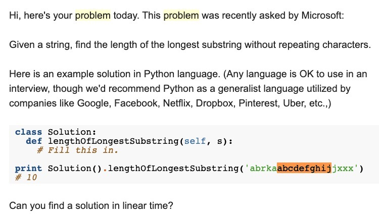

# Case 1

Kasus pertama itu nyari substring terpanjang tanpa adanya pengulangan huruf. Dari contoh di gambar, bisa dilihat dari yang sudah saya highlight. Substring abcdefghij merupakan substring terpanjang tanpa adanya pengulangan. Nah result of the solution cukup ngasi tau berapa panjang dari substring tersebut, semisal contoh diatas itu resultnya adalah 10 karna panjang dari abcdefghij  adalah 10 😃

Ohhh ya kasus ini biasa ditanyakan sama Microsoft #Katanya

Jangan lupa share solutionnya disini yah, biar kawan2 yang lain juga bisa tau solusinya gimana.